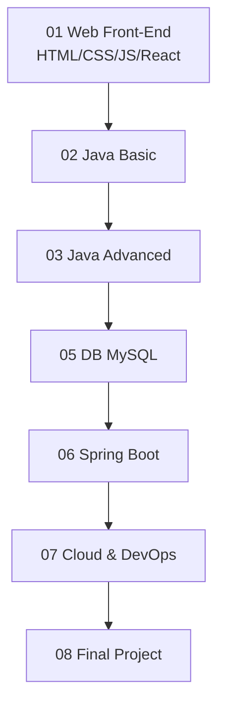

# jf-job-prep-bootcamp

Java 기반 풀스택 개발자로 취업하기 위한 **학습 로드맵 · 실습 코드 · 프로젝트 산출물**을 정리한 저장소입니다.  
이 저장소는 실무 개발자로 성장하기 위한 **웹 기초 → 자바 기초 → 데이터베이스 → 백엔드 → 클라우드/DevOps → 최종 프로젝트** 흐름을 담고 있습니다.

---

## 📚 Curriculum Overview  

### 1) Web Front-End (01_web_html_css_js / 04_react)
- HTML5 / CSS3 / JavaScript ES6+
- DOM 조작, 이벤트 모델, 비동기 처리
- React 기초 + SPA 개발
- 간단한 클론코딩 및 미니 프로젝트

### 2) Programming Foundations (02_java_basic / 03_java_advanced)
- Java 문법 & OOP
- Interface / Exception / IO / Collection / Thread
- 실습 문제 및 코드 리뷰

### 3) Database & SQL (05_db_mysql)
- MySQL 기본 문법 및 ERD 설계
- JDBC / ORM(JPA, Hibernate)
- 실습: 도서관리, 회원관리, 게시판 DB 설계

### 4) Back-End Development (06_spring_boot)
- Spring Framework / Spring Boot
- MVC, DI/IoC, AOP
- REST API & Controller 테스트(Postman 등)
- 로그인/회원가입/게시판 실습 프로젝트

### 5) Cloud & DevOps (07_cloud_devops)
- AWS EC2, RDS, S3
- Docker & Docker Compose
- Git / GitHub 협업
- CI/CD 개념 및 간단한 파이프라인 구성

### 6) Final Project (08_final_project)
- 팀/개인 웹서비스 개발
- ERD + API 문서 + 시연 영상 + 발표자료
- 코드 리뷰 및 기술면접 대비

---

## 🗺 전체 로드맵 (Mermaid)



---

## 📂 Repository Structure

```text
jf-job-prep-bootcamp/
 ├─ .gitignore
 ├─ .editorconfig
 ├─ .gitattributes
 ├─ README.md
 ├─ 01_web_html_css_js/
 ├─ 02_java_basic/
 ├─ 03_java_advanced/
 ├─ 04_react/
 ├─ 05_db_mysql/
 ├─ 06_spring_boot/
 ├─ 07_cloud_devops/
 ├─ 08_final_project/
 └─ .github/
     ├─ ISSUE_TEMPLATE/
     │   ├─ bug_report.md
     │   └─ feature_request.md
     └─ PULL_REQUEST_TEMPLATE.md
```

---

## 📌 How to Use

1. 프론트엔드(01, 04) → 자바(02, 03) → DB(05) → 백엔드(06) → 클라우드(07) → 프로젝트(08) 순으로 학습합니다.  
2. 각 단계별 실습 코드와 노트를 해당 폴더에 정리합니다.  
3. 최종 프로젝트와 면접 대비 자료를 08 폴더에 정리해 포트폴리오로 활용합니다.
